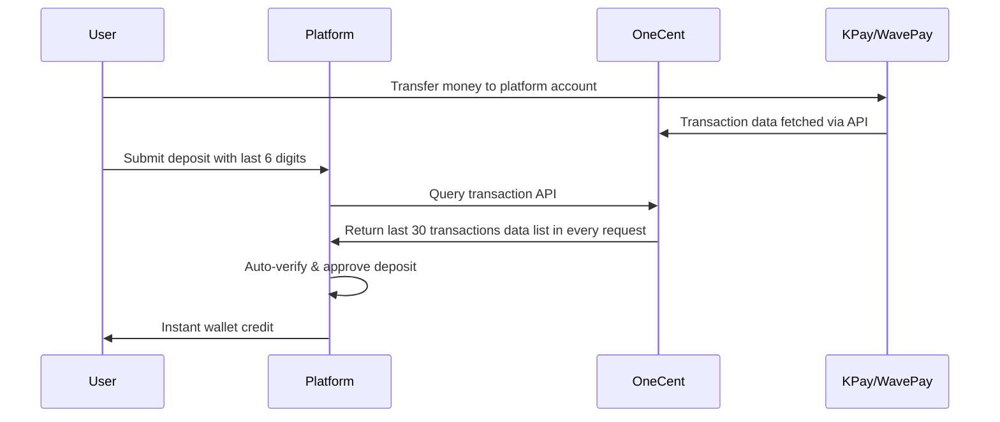

[🏠 Home](index.html) | [📄 Project Intro](OneCent_Project_Introduction.md) | [💰 Pricing Plan](OneCent_Pricing_Plan.md) | [📞 Contact Us](index.html#contact)

# OneCent - Automated Payment Verification System

## Executive Summary

**OneCent** is an innovative payment automation service designed specifically for online gaming platforms (2D/3D lottery and gaming hosts) in Myanmar. We provide real-time transaction data integration with KPay and Wave Pay, enabling platforms to automate their deposit verification process and eliminate the need for 24/7 manual monitoring staff.

---

## The Problem: Manual Deposit Verification

### Current Industry Challenge

Online gaming platforms in Myanmar face significant operational challenges with their current deposit systems:

#### How Manual Deposits Work Today

1. **User Initiates Deposit**
   - User transfers money via KPay or Wave Pay to platform's designated account
   - User submits deposit request with last 6 digits of transaction ID

2. **Manual Verification Required**
   - Platform staff must monitor KPay/Wave Pay mobile apps 24/7
   - Staff manually checks incoming transaction notifications
   - Staff cross-references transaction ID in admin panel
   - Manual approval required for each deposit

3. **Critical Pain Points**
   - ❌ **High Labor Costs** - Requires dedicated staff working round-the-clock
   - ❌ **Slow Processing** - Delays in verification lead to poor user experience
   - ❌ **Human Error** - Manual matching prone to mistakes and disputes
   - ❌ **Limited Scalability** - Cannot handle high transaction volumes efficiently
   - ❌ **Security Risks** - Reliance on staff access to payment accounts
   - ❌ **No Audit Trail** - Difficult to track and resolve discrepancies

### Why This Problem Exists

While KPay and Wave Pay are secure, widely-used payment platforms in Myanmar, they do not provide direct API access or automated data feeds to third-party gaming platforms. This forces platforms to rely on manual verification processes, creating inefficiencies and operational bottlenecks.

---

## Our Solution: OneCent Automated Verification API

### What We Provide

OneCent has successfully reverse-engineered and integrated with KPay and Wave Pay's embedded APIs to extract real-time transaction data. We provide this data as a secure, reliable API service to gaming platforms.

### How OneCent Works

### Technical Architecture

1. **Data Extraction Layer**
   - OneCent servers fetch transaction data from KPay and Wave Pay while platform call the OneCent transaction history  API
   - Secure connection to payment provider embedded APIs
   - Real-time data synchronization

2. **API Service Layer**
   - RESTful API endpoints for platform integration
   - Transaction query by payment type (Kpay or Wave Pay)

3. **Platform Integration**
   - Simple API integration into existing platform systems
   - Automatic matching of user submissions with transaction data
   - Instant deposit approval without human intervention

---

## Key Benefits for Platform Owners

### 💰 Cost Reduction

- **Eliminate 24/7 Staff Requirements** - No need for dedicated monitoring personnel
- **Reduce Operational Overhead** - Automated system handles unlimited transactions
- **Lower Error-Related Costs** - Minimize disputes and manual reconciliation

### ⚡ Operational Efficiency

- **Instant Verification** - Deposits processed in seconds, not minutes or hours
- **Scalable Processing** - Handle peak transaction volumes without additional resources
- **Automated Reconciliation** - Complete audit trail for all transactions

### 🔒 Enhanced Security & Reliability

- **Reduced Human Access** - Minimize staff access to sensitive payment accounts
- **Accurate Matching** - Eliminate human error in transaction verification
- **Fraud Prevention** - Automated validation reduces fraudulent deposit claims
- **Complete Audit Trail** - Every transaction logged and traceable

### 😊 Improved User Experience

- **Instant Deposits** - Users receive wallet credits immediately after payment
- **24/7 Availability** - No delays during off-hours or peak times
- **Reduced Disputes** - Automated system eliminates verification errors
- **Higher User Satisfaction** - Seamless, reliable deposit experience

### 📊 Business Intelligence

- **Real-Time Analytics** - Monitor deposit patterns and trends
- **Transaction History** - Complete records for compliance and reporting
- **Performance Metrics** - Track deposit success rates and processing times

---

## System Features

### Core Functionality

✅ **Transaction History Data**
- Feed of KPay and Wave Pay transactions
- Data synchronization
- Support for multiple payment accounts

✅ **Automated Verification**
- Match user-submitted transaction IDs with actual payment data
- Validate amount, timestamp, and account details
- Instant approval/rejection decisions

✅ **Multi-Account Support**
- Manage multiple KPay and Wave Pay accounts
- Route transactions to appropriate accounts
- Load balancing across payment channels

✅ **Comprehensive API**
- RESTful API with detailed documentation
- Sandbox environment for testing

✅ **Security & Compliance**
- Encrypted data transmission
- Secure authentication and authorization
- Transaction data privacy protection

✅ **Integration Support**
- Easy integration with existing platforms
- Sample code and SDKs provided
- Technical support during implementation

---

## Use Cases

### 1. High-Volume Gaming Platform
**Scenario:** Platform receives 500+ deposits daily during peak hours

**Without OneCent:**
- Requires 3-4 staff members working in shifts
- Average processing time: 5-15 minutes per deposit
- Monthly staff cost: ~ 2,000,000-3,000,000 MMK
- User complaints about delays

**With OneCent:**
- Zero manual verification required
- Average processing time: <10 seconds
- Monthly service cost: Fraction of staff costs
- Improved user retention and satisfaction

### 2. Multi-Platform Operator
**Scenario:** Company operates 5 different gaming platforms

**Without OneCent:**
- Each platform needs dedicated monitoring staff
- Difficult to share resources across platforms
- High operational complexity

**With OneCent:**
- Single API integration across all platforms
- Centralized transaction management
- Consistent user experience

### 3. New Platform Launch
**Scenario:** Startup launching new gaming platform

**Without OneCent:**
- Must hire and train verification staff before launch
- High initial operational costs
- Difficult to scale quickly

**With OneCent:**
- Launch with automated system from day one
- Low initial investment
- Scale seamlessly as user base grows

---

## Technology Stack

### OneCent Infrastructure

- **Backend Services:** High-performance servers for API integration
- **Data Processing:**  Transaction data extraction and normalization
- **API Gateway:** Secure, scalable API endpoints for platform integration
- **Database:** Redundant storage for transaction records and audit logs
- **Monitoring:** 24/7 system health monitoring and alerting

### Integration Requirements

Platforms can integrate OneCent with minimal technical requirements:

- **API Integration:** RESTful API calls (HTTP/HTTPS)
- **Authentication:** API key-based authentication
- **Data Format:** JSON request/response
- **Programming Language:** Language-agnostic (works with any backend)

---

## Implementation Process

### Phase 1: Onboarding (1-2 Days)
1. Account setup and API credentials provisioning
2. KPay/Wave Pay account configuration
3. Access to API documentation and sandbox environment

### Phase 2: Integration (3-7 Days)
1. Platform implements API calls in their system
2. Testing in sandbox environment
3. Technical support and troubleshooting

### Phase 3: Go-Live (1 Day)
1. Switch to production API endpoints
2. Monitor initial transactions
3. Verify automated deposit flow

### Phase 4: Optimization (Ongoing)
1. Performance monitoring and optimization
2. Feature updates and enhancements
3. Continuous technical support

---

## Competitive Advantages

### 🎯 Market-Specific Solution
- Built specifically for Myanmar's payment ecosystem
- Deep understanding of KPay and Wave Pay systems
- Tailored for gaming platform requirements

### 🚀 First-Mover Advantage
- Only automated solution in the market
- Proven technology with successful integration
- Established infrastructure and expertise

### 🛡️ Reliability & Uptime
- 99.9% service availability guarantee
- Redundant systems and failover mechanisms
- 24/7 technical monitoring

### 🤝 Partnership Approach
- Dedicated support team
- Regular updates and improvements
- Long-term commitment to platform success

---

## Success Metrics

Platforms using OneCent typically achieve:

- **95%+ reduction** in deposit processing time
- **100% elimination** of manual verification staff
- **50-70% reduction** in deposit-related operational costs
- **90%+ improvement** in user satisfaction scores
- **Zero human errors** in transaction verification

---

## Security & Compliance

### Data Security
- End-to-end encryption for all API communications
- Secure storage of transaction data
- Regular security audits and updates

### Privacy Protection
- Minimal data collection (only transaction-related information)
- No storage of sensitive user personal information
- Compliance with data protection best practices

### System Reliability
- Redundant server infrastructure
- Automatic failover and backup systems
- Regular system maintenance and updates

---

*OneCent - Automating the Future of Gaming Platform Payments in Myanmar*
